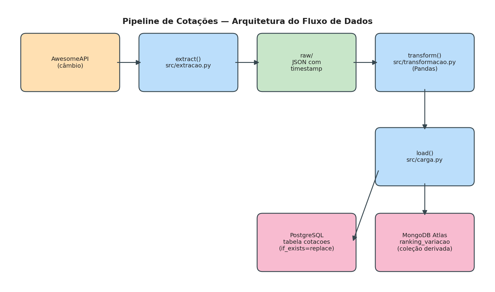

# Pipeline de Cotações — AwesomeAPI → PostgreSQL + MongoDB Atlas

Pipeline de dados completo que coleta cotações de moedas (USD, EUR e BTC em relação ao Real), trata os dados com Pandas e carrega o resultado em duas bases diferentes: uma tabela relacional no PostgreSQL e uma coleção derivada (ranking) no MongoDB Atlas.

## O que o pipeline faz e por que essa API

A fonte é a [AwesomeAPI de câmbio](https://docs.awesomeapi.com.br/api-de-moedas), que não exige chave de acesso e retorna, em uma única chamada, a cotação de compra/venda, a variação e o horário de referência de vários pares de moedas. Escolhi essa API porque ela é estável, rápida de testar e já traz campos numéricos suficientes para justificar validações e agregações reais (variação percentual, máxima, mínima), sem a complexidade de paginação.

O pipeline, de ponta a ponta:

1. **Extrai** (`src/extracao.py`): faz `GET` em `https://economia.awesomeapi.com.br/json/last/USD-BRL,EUR-BRL,BTC-BRL` com timeout de 10s, `raise_for_status()` e tratamento de exceções (timeout, erro HTTP, erro de conexão, JSON inválido).
2. **Salva a camada raw**: grava o JSON bruto, sem nenhuma alteração, em `raw/AAAA-MM-DD_HHMM_cotacoes.json`.
3. **Transforma** (`src/transformacao.py`): achata o dicionário de moedas em um DataFrame, renomeia colunas para português, converte campos numéricos e de data, remove registros com dados obrigatórios nulos e valida o resultado antes de seguir.
4. **Carrega no PostgreSQL** (`src/carga.py`): grava a tabela `cotacoes` via SQLAlchemy/`to_sql`.
5. **Carrega no MongoDB Atlas** (`src/carga.py`): grava a coleção derivada `ranking_variacao`, um ranking das moedas ordenado pela variação percentual absoluta — não é cópia da tabela.
6. **Orquestra tudo** (`src/pipeline.py`): chama as três etapas em sequência, com `logging` em vez de `print`.

## Estrutura do repositório

```
├── README.md
├── requirements.txt
├── config.py               <- você cria o seu (não é versionado)
├── .gitignore              <- ignora o config.py real
├── src/
│   ├── extracao.py        <- extract() / save_raw()
│   ├── transformacao.py   <- transform() / _validate()
│   ├── carga.py            <- load_postgres() / load_mongo_derived()
│   └── pipeline.py         <- orquestra extract -> transform -> load
├── raw/                    <- coletas reais em JSON, com timestamp no nome
└── docs/
    ├── arquitetura.png     <- diagrama do fluxo de dados
    └── evidencias/          <- prints da tabela no Postgres e da coleção no Atlas
```

> `config.py` não existe no repositório clonado — é você quem cria esse arquivo localmente (veja a seção abaixo). Ele está no `.gitignore` e nunca deve ser commitado.

## Como rodar do zero

```bash
# 1. Criar e ativar o ambiente virtual
python -m venv venv
venv\Scripts\activate        # Windows
# source venv/bin/activate   # Linux/Mac

# 2. Instalar as dependências
pip install -r requirements.txt
```

### 3. Configurar credenciais (config.py)

O `config.py` não vem no repositório — crie-o manualmente na raiz do projeto.


Salve como `config.py` na raiz do projeto (ao lado do `README.md`). Como ele está no `.gitignore`, nunca será commitado — cada pessoa que clonar o repositório precisa criar o seu próprio.

### 4. Executar o pipeline

```bash
python -m src.pipeline
```

Ao final, a tabela `cotacoes` estará no PostgreSQL configurado e a coleção `ranking_variacao` estará no banco do MongoDB Atlas configurado no `config.py`.

## Decisões do projeto

- **`if_exists="replace"` no PostgreSQL**: cada execução do pipeline coleta um retrato (snapshot) completo das cotações no momento da coleta. Usar `replace` garante que rodar o pipeline várias vezes não duplica linhas na tabela, sem precisar de upsert manual ou chave única — e o histórico de cada coleta continua preservado na camada raw, em JSON com timestamp.
- **Coleção derivada `ranking_variacao`**: em vez de copiar a tabela do Postgres para o Atlas, a carga no MongoDB calcula um ranking das moedas ordenado pela variação percentual absoluta (quem mais subiu ou caiu), mantendo apenas os campos relevantes para essa visão resumida. A cada execução, a coleção é limpa (`delete_many({})`) antes de inserir o novo ranking, o que também garante idempotência.
- **Validações antes da carga**: o pipeline descarta registros sem moeda de origem/destino ou sem preço de compra/venda, preenche `variacao_percentual` ausente com `0.0` e interrompe a execução (`raise ValueError`) se, depois da limpeza, o DataFrame ficar vazio, faltar alguma coluna obrigatória ou algum preço vier menor ou igual a zero — evitando que dado inconsistente chegue às bases.
- **Segredos fora do código**: nenhuma senha, API key ou connection string real está no repositório. As credenciais reais ficam em `config.py`, na raiz do projeto, listado no `.gitignore` — esse arquivo nunca é commitado, e este README documenta exatamente a estrutura que ele precisa ter para quem for rodar o projeto do zero.
- **Logging em vez de print**: todas as etapas usam o módulo `logging`, com nível `INFO` para o fluxo normal e `WARNING`/`ERROR` para descartes e falhas, facilitando depurar o pipeline em produção.

## Diagrama de arquitetura



O fluxo: AwesomeAPI → `extract()` → `raw/` (JSON com timestamp) → `transform()` (Pandas) → `load()` → PostgreSQL (tabela `cotacoes`) e MongoDB Atlas (coleção derivada `ranking_variacao`).

## Evidências

Os prints da tabela `cotacoes` no PostgreSQL e da coleção `ranking_variacao` no MongoDB Atlas estão em [`docs/evidencias/`](docs/evidencias/).
